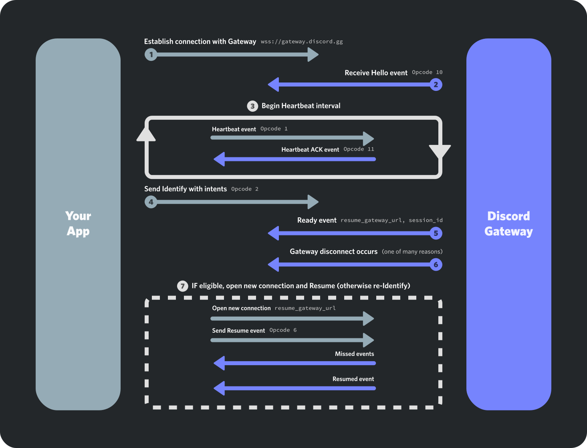

# Discord ws client

Simple implementation of discord gateway



# How To Install

Enable virtual env

```zsh
python3 -m venv .
# or
uv venv # If you're using uv package manager
```

Install Requirements

```zsh
pip install -r requirements.txt
# or
uv pip install -r requirements.txt
```

Run

```zsh
DISCORD_TOKEN='....' python3 src/main.py
```
